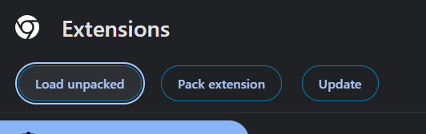

# Kurulum
 
1. Repoyu indirin
 

2. Zip dosyasini bir klasore acin
 

3. Google Chrome ayarlarindan 'manage extensions'i secin.
 

4. "Load unpack" secenegi ile bilgisyarinizda bulunan bir extension'i kullanma secenegine tiklayin
 

5. Zip'ten actiginiz klasoru secin
 

6. Hadi gecmis olsun
 
